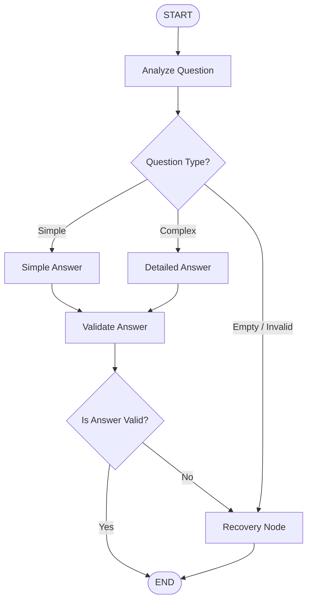

# Task 4.2 Workflow Diagram

```mermaid
flowchart TD
    A([START]) --> B[Analyze Question]
    B --> C{Question Type?}
    C -->|Simple| D[Simple Answer]
    C -->|Complex| E[Detailed Answer]
    C -->|Empty / Invalid| G[Recovery Node]
    D --> F[Validate Answer]
    E --> F
    F --> H{Is Answer Valid?}
    H -->|Yes| I([END])
    H -->|No| G
    G --> I
```